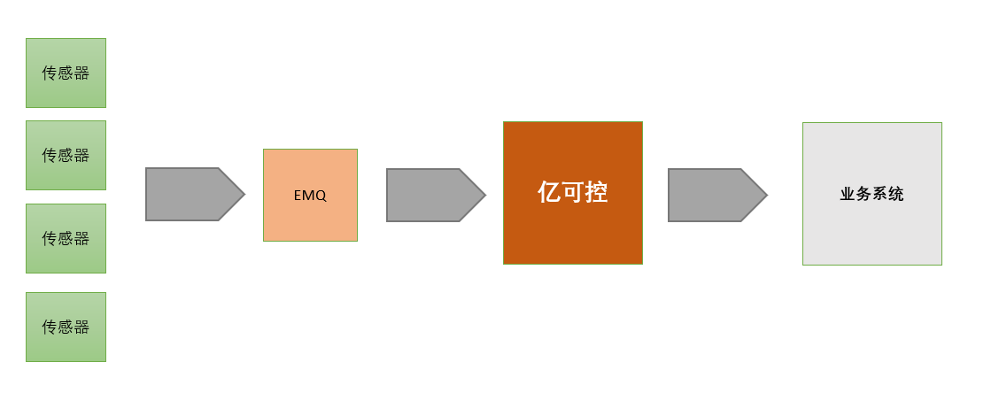

演示地址 ：https://www-ykk-java.itheima.net/#/login?redirect=%2Fdashboard

### 一、需求概述

​      亿可控作为一个中台，对设备运行状况进行实时在线监测、预警，不做业务相关的功能。



​	核心功能列表：

​	（1）报文数据采集与指标解析 ：整个系统的数据来源是通过接收设备发送过来的报文消息，在系统中定义主题和消息内容字段的指标数据为过滤条件，从而对消息进行收集和分析。

​	（2）报警监控  ： 通过和系统中定义的各种告警级别数据进行对比，一旦发现触发到告警级别的消息，就会通过和告警关联配置的webhook来将告警信息透传到其它系统

​    （3）GPS定位监控 ：采集每台设备的GPS定位，并提供设备位置查询功能。

​    （4）数据看板 :   提供丰富的自定义数据看板。

### 二、项目背景

#### 什么是物联网

**物联网**（英文：*Internet of Things*，缩写：*IoT*）起源于传媒领域，是信息科技产业的第三次革命。物联网是指通过信息传感设备，按约定的协议，将任何物体与网络相连接，物体通过信息传播媒介进行信息交换和通信，以实现智能化识别、定位、跟踪、监管等功能。 

在物联网应用中有三项关键技术，分别是感知层、网络传输层和应用层。 

**中国式物联网定义：**

最简洁明了的定义：物联网(Internet of Things)是一个基于互联网、传统电信网等信息承载体，让所有能够被独立寻址的普通物理对象实现互联互通的网络。它具有普通对象设备化、自治终端互联化和普适服务智能化3个重要特征。


上图中出现了四个概念，我们这里分别解释一下：

**两化融合**是信息化和工业化的高层次的深度结合， 是指以信息化带动工业化、以工业化促进信息化，走新型工业化道路；两化融合的核心就是信息化支撑，追求可持续发展模式。

**M2M**全称Machine to Machine，是指数据从一台终端传送到另一台终端，也就是机器与机器的对话。

射频识别（RFID）是 Radio Frequency Identification 的缩写。其原理为阅读器与标签之间进行非接触式的数据通信，达到识别目标的目的。RFID 的应用非常广泛，典型应用有动物晶片、汽车晶片防盗器、门禁管制、停车场管制、生产线自动化、物料管理。

**传感网**是传感器网络的简称，传感器网络是集[计算机](https://wiki.mbalib.com/wiki/%E8%AE%A1%E7%AE%97%E6%9C%BA)、[通信](https://wiki.mbalib.com/wiki/%E9%80%9A%E4%BF%A1)、网络、智能计算、传感器、[嵌入式系统](https://wiki.mbalib.com/wiki/%E5%B5%8C%E5%85%A5%E5%BC%8F%E7%B3%BB%E7%BB%9F)、微电子等多个领域交叉综合的新兴学科，它将大量的多种类传感器节点(集传感、采集、处理、收发于一体)组成自治的网络，实现对物理世界的动态智能协同感知。

从上图中可以看出，物联网涵盖了上边所提到的四大领域。

**“一句式”理解物联网**

把所有物品通过信息传感设备与互联网连接起来，进行信息交换，即物物相息，以实现智能化识别和管理。

### 三、业务架构图


从上图我们可以看到，真个系统从业务上分为6大功能模块：图形监控模块、数据详情展示模块、看板管理模块、设备管理模块、报警管理模块、系统管理模块。

### 四、 核心业务描述

产品原型地址：

[https://app.mockplus.cn/run/prototype/yYVLQlJ-YN6/JhE4uVilt/4nw_LQ8n7](https://app.mockplus.cn/run/prototype/yYVLQlJ-YN6/JhE4uVilt/4nw_LQ8n7)

详见资源提供的《亿可控PRD文档》

## 五、亿可控系统架构

### 系统架构图

整个系统的技术架构图如下：


预制数据将放入MySQL里进行存储，设备上报的指标数据包括告警数据将存入influxDB中，设备的地理位置信息数据存入到ES中以便后期搜索。为了提高系统的运行稳定性，有些频繁访问的数据储存在redis中，因为考虑到设备上报的数据是非常频繁的，如果单单只依靠MySQL数据库的话，会很容易将MySQL服务器的CPU的占用率搞到100%，从而会引发整个系统的崩溃无法使用。

一些基本的配置放入到了consul的配置中心，考虑到系统的横向扩展能力，将整个系统基于Consul做注册中心来搭组建一个微服务。

### 数据库设计

mysql数据库有5个表：

**管理员表tb_admin**

| 列名       | 数据类型    | 说明                                          |
| ---------- | ----------- | --------------------------------------------- |
| id         | int         | 表主键id，自增                                |
| login_name | varchar(50) | 登录账号                                      |
| password   | varchar(60) | 密码                                          |
| type       | tinyint     | 类型 1:超级管理员 2:普通用户 目前作为保留字段 |
| board      | varchar(50) | 看板列表                                      |

**指标配置表tb_quota**

| 列名            | 数据类型      | 说明                                   |
| --------------- | ------------- | -------------------------------------- |
| id              | int           | 表主键id                               |
| name            | varchar(50)   | 指标名称                               |
| unit            | varchar(20)   | 指标单位                               |
| subject         | varchar(50)   | 报文主题                               |
| value_key       | varchar(50)   | 指标值字段                             |
| sn_key          | varchar(50)   | 设备识别码字段                         |
| webhook         | varchar(1000) | web钩子                                |
| value_type      | varchar(10)   | 指标字段类型，Double、Inteter、Boolean |
| reference_value | varchar(100)  | 参考值                                 |

**报警配置表tb_alarm**

| 列名      | 数据类型      | 说明                     |
| --------- | ------------- | ------------------------ |
| id        | int           | 表主键id，自增           |
| name      | varchar(50)   | 报警指标名称             |
| quota_id  | int           | 关联指标名称             |
| operator  | varchar(10)   | 运算符                   |
| threshold | int           | 报警阈值                 |
| level     | int           | 报警级别 1：一般 2：严重 |
| cycle     | int           | 沉默周期(以分钟为单位)   |
| webhook   | varchar(1000) | web钩子地址              |

**面板配置表tb_board**

| 列名     | 数据类型     | 说明           |
| -------- | ------------ | -------------- |
| id       | int          | 表主键id，自增 |
| admin_id | int          | 管理员id       |
| name     | varchar(50)  | 看板名称       |
| quota    | varchar(100) | 指标           |
| device   | varchar(100) | 设备           |
| system   | tinyint      | 是否是系统看板 |
| disable  | tinyint      | 是否不显示     |

**GPS配置表tb_gps**

| 列名       | 数据类型    | 说明                   |
| ---------- | ----------- | ---------------------- |
| id         | bigint      | 表主键id               |
| subject    | varchar(50) | 报文主题               |
| sn_key     | varchar(50) | 设备识别码字段         |
| type       | tinyint     | 类型（单字段、双字段） |
| value_key  | varchar(50) | 经纬度字段             |
| separation | varchar(10) | 经纬度分隔符           |
| longitude  | varchar(20) | 经度字段               |
| latitude   | varchar(20) | 维度字段               |

## 六、前后端联调

### 6.1 运行微服务

（1）启动VM虚拟机镜像

（2）启动亿可控工程

### 6.2 运行前端工程

#### 6.2.1 前端运行环境

（1）安装node.js

（2）安装Yarn （类似npm的包管理工具）

这两个安装文件我们资料中已经提供（资料\环境\前端环境）

#### 6.2.2 安装依赖与运行

（1）进入project-yikekong-cmm-ts-vue-v2.0工程目录的控制界面，输入命令，安装依赖

```
yarn install
```

（2）修改project-yikekong-cmm-ts-vue-v2.0工程的vue.config，将target地址改为本地微服务地址

```
proxy: {
      '/api': {
        target: `http://127.0.0.1:9093`,
        // target: `https://mock.boxuegu.com/mock/1094`,
        changeOrigin: true,
        pathRewrite: {
          '^/api': ''
        }
      }
```

（3）运行

```
yarn serve
```

Ctrl+C  终止运行