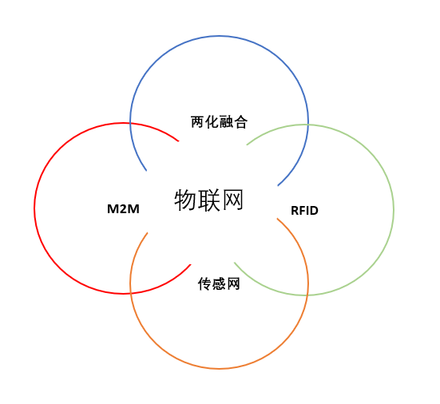

<!-- 项目标题与徽章 -->

  # 💡 亿可控  
  **物联网设备监控中台**  
  *实时监测设备运行状态，提供预警能力，不涉及业务功能*

  <!-- 技术栈滚动徽章 -->
  

    
    
    
    
    
  

---

## 🌐 演示地址  
[https://www-ykk-java.itheima.net/#/login?redirect=%2Fdashboard](https://www-ykk-java.itheima.net/#/login?redirect=%2Fdashboard)

---

## 📌 项目概述  
### 核心功能  
1. **报文数据采集与指标解析**  
   - 接收设备报文消息，通过预定义主题和字段指标过滤条件进行数据收集与分析

2. **报警监控**  
   - 对比告警级别数据，触发时通过 Webhook 将告警透传到其他系统

3. **GPS定位监控**  
   - 采集设备GPS定位信息，提供设备位置查询功能

4. **数据看板**  
   - 提供丰富的自定义数据可视化看板

---

## 🌐 技术背景  
### 物联网架构解析  
**物联网**（Internet of Things, IoT）是继计算机、互联网之后信息技术的第三次革命，具备以下特征：
- **感知层**：RFID、传感器等设备
- **网络传输层**：M2M通信、无线网络
- **应用层**：智能识别、定位、监管

### 关键概念  
| 技术 | 说明 |
|------|------|
| **两化融合** | 信息化与工业化的深度结合 |
| **M2M** | Machine to Machine 设备间通信 |
| **RFID** | 非接触式数据通信，用于识别与追踪 |
| **传感网** | 多领域交叉学科，实现物理世界动态感知 |

---

## 📐 系统架构  
### 业务架构  

系统包含六大功能模块：
1. 图形监控
2. 数据详情展示
3. 看板管理
4. 设备管理
5. 报警管理
6. 系统管理

### 技术架构  

### 数据存储方案  
| 数据类型 | 存储方案 | 特性说明 |
|---------|----------|---------|
| 预制数据 | MySQL | 基础信息存储 |
| 指标数据 | InfluxDB | 时序数据存储 |
| 地理位置 | ElasticSearch | 快速空间检索 |
| 缓存数据 | Redis | 提升高频访问性能 |

---

## 🗂️ 数据库设计  
### MySQL 表结构  
#### 1. 管理员表 `tb_admin`  
| 字段 | 类型 | 说明 |
|------|------|------|
| id | int | 主键 |
| login_name | varchar(50) | 登录账号 |
| password | varchar(60) | 密码 |
| type | tinyint | 类型（1:超级管理员 2:普通用户） |
| board | varchar(50) | 看板列表 |

#### 2. 指标配置表 `tb_quota`  
| 字段 | 类型 | 说明 |
|------|------|------|
| name | varchar(50) | 指标名称 |
| subject | varchar(50) | 报文主题 |
| value_key | varchar(50) | 指标值字段 |
| webhook | varchar(1000) | 告警回调地址 |

#### 3. 报警配置表 `tb_alarm`  
| 字段 | 类型 | 说明 |
|------|------|------|
| name | varchar(50) | 报警指标名称 |
| quota_id | int | 关联指标ID |
| operator | varchar(10) | 运算符 |
| threshold | int | 报警阈值 |
| level | int | 报警级别（1:一般 2:严重） |

---
### 🔗 项目链接 & 社区支持  
  
🚀 项目地址：[https://gitee.com/itxinfei/yikekong](https://gitee.com/itxinfei/yikekong)  
👥 QQ交流群：[661543188](https://qm.qq.com/cgi-bin/qm/qr?k=gNgch-wCkfUu-QbI7DZSudrax2BN7vY0&jump_from=webapi&authKey=QHSRnxQvu+h5S3AXGn/DSHrVPiFQAYEk6bSlCE1lS276SFjQAUagV4FG7bHf0OSM)  
📧 邮箱支持：[747011882@qq.com](http://mail.qq.com/cgi-bin/qm_share?t=qm_mailme&email=f0hLSE9OTkdHTT8ODlEcEBI)  